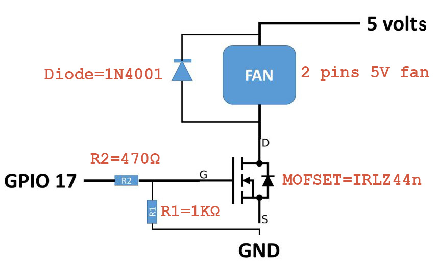

# Simple MOFSET solution to have a PWM 2 pins fan on a raspberry pi

This implements Andreas Spiess' article and python code (http://www.sensorsiot.org/variable-speed-cooling-fan-for-raspberry-pi-using-pwm-video138/); thanks to him for this nice PWM solution.

I have simply removed the battery related code (unused), add a systemd service to start the program at boot at log the last output information (details as log and the fan speed % value).

## Hardware

Components:
- MOFSET IRLZ44n
- R1 1K ohms
- R2: 470 ohms
- Flyback diode 1N4001
- 5V 2 pins fan

Wire chart: 

## Software

I've just modified the following stuffs on the python script:
- remove all battery-related code (unused)
- new log file for the debug and fan speed output, so I can read them with a LUA script in Domoticz

I've also added a new simple systemd service.

Setup:
```
cd /home/pi
git clone <THIS REPO> pwm_fan
cd pwm_fan
chmod 755 /home/pi/pwm_fan/pwm_mofset_GPIO_17.service
sudo ln -s /home/pi/pwm_fan/pwm_mofset_GPIO_17.service /etc/systemd/system/pwm_mofset_GPIO_17.service
sudo systemctl daemon-reload
sudo systemctl start pwm_mofset_GPIO_17
sudo systemctl status -a pwm_mofset_GPIO_17
sudo systemctl enable pwm_mofset_GPIO_17
```

Example of status output:
```
$ sudo systemctl status -a pwm_mofset_GPIO_17
● pwm_mofset_GPIO_17.service - Simple GPIO 17 PWM fan with MOFSET script
   Loaded: loaded (/home/pi/pwm_fan/pwm_mofset_GPIO_17.service; enabled; vendor preset: enabled)
   Active: active (running) since Sun 2020-01-19 19:38:24 CET; 44min ago
 Main PID: 9990 (python)
    Tasks: 2 (limit: 4915)
   Memory: 2.5M
   CGroup: /system.slice/pwm_mofset_GPIO_17.service
           └─9990 /usr/bin/python /home/pi/pwm_fan/pwm_mofset_GPIO_17.py

Jan 19 19:38:24 raspberrypi4.xxx.com systemd[1]: Started Simple GPIO 17 PWM fan with MOFSET script.
```

Logs:
```
$ watch -n 5 cat /var/log/pwm_mofset_GPIO_17.log
Every 5.0s: cat /var/log/pwm_mofset_GPIO_17.log             raspberrypi4.xxx.com: Sun Jan 19 19:44:50 2020
actualTemp 46.00 TempDiff 1.00 pDiff 15.00 iDiff 10.40 fanSpeed    25

$ watch -n 5 cat /var/log/pwm_mofset_GPIO_17.speed
Every 5.0s: cat /var/log/pwm_mofset_GPIO_17.speed             raspberrypi4.xxx.com: Sun Jan 19 19:52:12 2020
25
```
